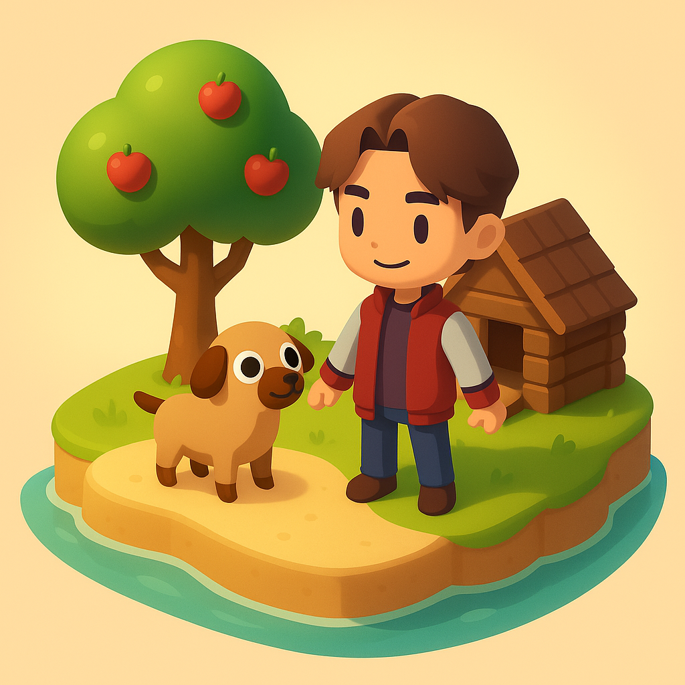
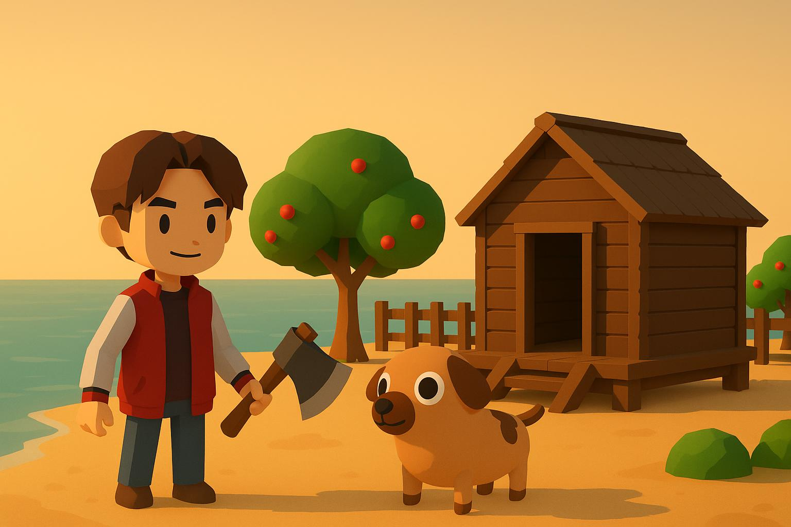

<div align="center">



# Cozy Adventure

*A cozy 3D survival and building game that runs right in your browser.*


[Features](#features) • [Getting started](#getting-started) • [Controls](#controls) • [Development](#development) • [Architecture](#architecture) • [Contributing](#contributing) • [Roadmap](#roadmap)

</div>



Cozy Adventure is a relaxed survival and building game set on a sunny low-poly island. Chop trees, gather resources, farm, build a home on a snapping grid, and explore with a friendly dog at your side. It is built with [Three.js](https://threejs.org/), written in TypeScript, and bundled with [Vite](https://vite.dev/), so the whole thing runs in a browser with no plugins.

> [!NOTE]
> This game was originally exported from an AI playground platform. It is designed to run **embedded in a host page inside an iframe** and talks to its host through `window.parent` `postMessage`. It also runs locally via the Vite dev server (`pnpm dev`).

## Features

- **Explore and gather:** Roam a hand-built island in third person, chop trees, and collect resources.
- **Modular building:** Place walls, floors, and ramps on a snapping grid, across multiple levels, with a live placement preview.
- **Farming:** Plant, grow, and harvest crops to keep your supplies stocked.
- **Dog companion:** A loyal low-poly dog follows you around and reacts to the world.
- **Inventory and hotbar:** Manage what you carry, equip held items, and drop or use them.
- **Health and survival:** A health system tracks your wellbeing as you play.
- **Persistent saves:** Your world, inventory, and buildings are saved and restored between sessions.
- **Compass and HUD:** Lightweight in-game UI keeps you oriented without getting in the way.
- **Desktop and mobile controls:** Keyboard and mouse on desktop, touch controls on mobile.
- **Optional co-op multiplayer:** Join a shared, server-authoritative world from the menu (enter a server URL) and see others move, build, and gather in real time. Single-player stays the default and runs fully offline.

## Getting started

> [!IMPORTANT]
> Requires **Node.js >= 20**. If you use [nvm](https://github.com/nvm-sh/nvm), run `nvm use` to match the version in `.nvmrc`.

This is a **pnpm monorepo** (workspaces `@cozy/game`, `@cozy/shared`, `@cozy/server`); use pnpm, not npm.

```bash
pnpm install     # install all workspaces
pnpm dev         # start the game dev server with HMR at http://localhost:5173
pnpm build       # build every workspace
pnpm --filter @cozy/game preview  # serve the built game locally
```

Open the dev server URL in your browser, start a new game from the menu, and you are on the island.

### Multiplayer (optional)

Run the authoritative server (in-memory, no database needed) in one terminal and the game in another:

```bash
pnpm --filter @cozy/server dev    # ws://localhost:8080
pnpm --filter @cozy/game dev      # http://localhost:5173
```

In the game menu, open **Multiplayer**, enter the server URL (`ws://localhost:8080`) and a password if the server set one, then **Join**. Two clients on the same URL share one world. Self-hosting with Docker + PostgreSQL is documented in [`apps/server/README.md`](apps/server/README.md).

## Controls

| Action | Input |
| --- | --- |
| Move | `W` `A` `S` `D` |
| Run | `Shift` |
| Look / aim camera | Mouse |
| Interact / chop / harvest | `E` |
| Toggle build mode | `V` |
| Rotate placement | `R` |
| Switch between build and delete | `X` |
| Center on current selection | `C` |
| Exit build mode / close panels | `Esc` |

> [!TIP]
> Press `V` at any time to enter build mode, then `X` to flip between placing and removing pieces. On touch devices the on-screen controls replace the keyboard.

### Touch controls

On touch devices a control overlay appears automatically (and hides again on desktop). A floating **virtual joystick** on the left half moves the character with analog intensity, **dragging the right half** orients the camera (both at once), and a quick **tap** in the world chops or uses. A contextual **Recoger** button appears to pick up nearby items, **tapping a hotbar slot** selects it, and the **🔨** button toggles build mode, where **Rotar / Modo / Centrar** act like `R` / `X` / `C` and a tap places the piece where the camera is aimed.

## Development

The project is TypeScript ESM in a **pnpm monorepo**. The quality gates run across all workspaces and are expected to stay green before changes land.

| Script | What it does |
| --- | --- |
| `pnpm dev` | Game (`@cozy/game`) Vite dev server with HMR |
| `pnpm --filter @cozy/server dev` | Authoritative multiplayer server (tsx watch, in-memory store) |
| `pnpm -r run build` | Build every workspace (game via Vite, server via tsup) |
| `pnpm -r run lint` | ESLint across workspaces |
| `pnpm -r run typecheck` | Type-check every workspace with `tsc` (strict) |
| `pnpm -r run test` | Run the Vitest suites (game + server) |

> Run a single workspace's script with `pnpm --filter @cozy/<pkg> <script>`.

> [!WARNING]
> `three` is pinned to an exact version (`0.185.0`). Three.js ships breaking changes in minor releases and `three/addons` loaders must match the core version exactly, so bump core and addons together (and keep `@types/three` on the same version).

## Contributing

Contributions are welcome. Before committing, keep the quality gates green (`lint`, `typecheck`, `test`, `build`). Every commit message **must** follow [Conventional Commits](https://www.conventionalcommits.org/) and be written in **English** (mandatory). See [`CONTRIBUTING.md`](CONTRIBUTING.md) for the full guidelines.

## Project structure

A pnpm monorepo of three workspaces:

```text
cozy-adventure/
├─ apps/
│  ├─ game/                # @cozy/game: the client (Three.js + Vite)
│  │  ├─ index.html        # entry; loads src/main.ts and host scripts
│  │  ├─ src/              # game source (TypeScript ESM, ~33 modules)
│  │  │  ├─ game.ts        # Game orchestrator (composes systems via DI)
│  │  │  ├─ main.ts        # bootstraps Game and drives the render loop
│  │  │  ├─ environment.ts # scene, terrain, and colliders
│  │  │  ├─ BuildingSystem.ts, TreeChoppingSystem.ts, ...  # gameplay systems
│  │  │  ├─ SaveSystem.ts  # persistence across sessions
│  │  │  └─ net/           # multiplayer client (NetworkSystem/Session, ClientWorld, RemotePlayer)
│  │  ├─ public/           # host integration scripts and game assets
│  │  └─ test/             # Vitest suites (incl. headless net/ tests)
│  └─ server/              # @cozy/server: authoritative multiplayer server (no three; Docker)
├─ packages/
│  └─ shared/              # @cozy/shared: three-free kernel (rng, protocol, state, worldState reducer)
├─ web/                    # standalone landing page and art
└─ scripts/                # asset and art generation tooling
```

## Architecture

`apps/game/index.html` loads `main.ts`, which constructs `Game` (`game.ts`) and drives the render loop via `requestAnimationFrame`. `Game` is the orchestrator: `init()` wires up the menu and save UI, while `startGame()` builds the 3D world and every gameplay system. Systems are composed through **constructor dependency injection** (collision, building, tree chopping, farming, inventory, saving), and the global game instance is exposed as `window.gameInstance`.

The world and its colliders are built by `Environment`, tagged via `userData`, and read back by `CollisionSystem`. Saving is split by category (player, inventory, environment, buildings, world state) and persisted with chunking to fit storage limits inside the host iframe.

Multiplayer is an **optional, server-authoritative** layer that leaves single-player untouched. The client `net/` layer (DOM-free, testable headlessly) connects to `@cozy/server`, regenerates the same world from the server's seed, relays the local avatar at ~15 Hz, and renders interpolated remote players. World mutations (chop, build, pickup) become **commands applied on the server's confirmed event**, so two clients never desync. The wire contract and the world-diff reducer are shared in `@cozy/shared`. See [`CLAUDE.md`](CLAUDE.md) for the details.

> [!NOTE]
> For the full architecture notes, conventions, and non-obvious gotchas, see [`CLAUDE.md`](CLAUDE.md). For the prioritized improvement roadmap and known issues, see [`docs/PROPUESTA-MEJORAS.md`](docs/PROPUESTA-MEJORAS.md).

## Roadmap

**Co-op multiplayer is implemented** (specs 002 server + 003 client): an authoritative `@cozy/server` hosting one shared world per process, and a client that connects from the menu, regenerates the world from the server's seed, shows other players in real time, syncs building/chopping/gathering through server-validated commands, and reconnects after a drop. World generation is deterministic (seeded RNG in `packages/shared/rng.ts`) so every client builds the same island.

Next: a browser playtest of the shared-world and reconnect flows, then standalone hosting (outside the playground iframe, on self-managed AWS). See `docs/PROPUESTA-MULTIJUGADOR.md` for the original direction and `apps/server/README.md` for self-hosting.

## Resources

- [Three.js documentation](https://threejs.org/docs/)
- [Vite guide](https://vite.dev/guide/)
- [`CLAUDE.md`](CLAUDE.md): architecture, conventions, and gotchas
- [`CONTRIBUTING.md`](CONTRIBUTING.md): commit conventions and quality gates
- [`docs/PROPUESTA-MEJORAS.md`](docs/PROPUESTA-MEJORAS.md): improvement roadmap and known bugs
